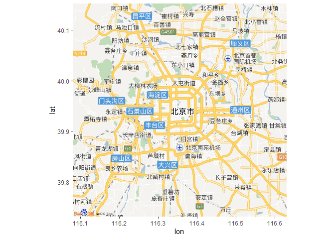
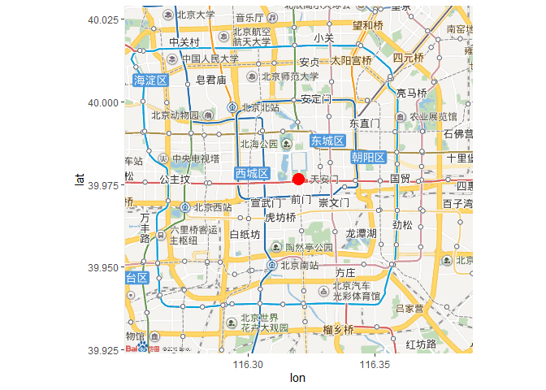

<!-- README.md is generated from README.Rmd. Please edit that file -->

# baidumap

<!-- badges: start -->

<!-- badges: end -->

最近救活了R语言一个废弃了3年的R包，`baidumap`。`baidumap`可以用来获取给定地名的
经纬度位置，也可以根据经纬度信息获取POI数据。主要功能如下：

``` r
library(baidumap)
# 1. 给定经纬度，获取POI信息
loc <- matrix(c(
  117.93780, 24.55730, 
  117.93291, 24.57745, 
  117.23530, 24.64210, 
  117.05890, 24.74860), byrow = T, ncol = 2)
location <- get_location(loc) 
print(location)
#>        lng      lat province   city city_level district town town_code adcode
#> 1 117.9489 24.56052   福建省 厦门市          2   海沧区                350205
#> 2 117.9440 24.58058   福建省 厦门市          2   海沧区                350205
#> 3 117.2466 24.64561   福建省 漳州市          2   南靖县                350627
#> 4 117.0705 24.75157   福建省 漳州市          2   南靖县                350627
#>         street street_number direction distance              formatted_address
#> 1 X428(孚莲路)                                  福建省厦门市海沧区X428(孚莲路)
#> 2     天竺山路                                      福建省厦门市海沧区天竺山路
#> 3       奎船线                                        福建省漳州市南靖县奎船线
#> 4                                                           福建省漳州市南靖县
#>   business pois roads poiRegions sematic_description cityCode
#> 1     东孚   NA    NA         NA                          194
#> 2     东孚   NA    NA         NA                          194
#> 3            NA    NA         NA                          255
#> 4            NA    NA         NA                          255

# 2. 给定地名，获取经纬度
get_coord(c("中国地质大学（武汉）")) # matrix
#>        lng      lat confidence comprehension level
#> 1 114.4085 30.52576         70           100  教育

# 3. 查询POI
get_place("水库", "武汉")
#>         lat      lng                           name
#> 1  30.50941 114.5118                       九峰水库
#> 2  30.36388 114.3586                   江夏齐心水库
#> 3  31.05837 114.3030                       泥河水库
#> 4  30.50094 114.5663                       九龙水库
#> 5  31.10948 114.3149                     院基寺水库
#> 6  30.99695 114.5267                     吴家寺水库
#> 7  30.33820 114.2724                       红旗水库
#> 8  31.09644 114.4879                     夏家寺水库
#> 9  31.21161 114.3145                       梅店水库
#> 10 31.09826 114.2173                       矿山水库
#> 11 30.81085 114.4525                     薛家咀水库
#> 12 30.86775 115.0146                     道观河水库
#> 13 30.79310 114.9236                     观音崖水库
#> 14 30.84451 114.9836                     少潭河水库
#> 15 31.02010 114.2788                       劳动水库
#> 16 30.79169 114.9246                     孔子河水库
#> 17 30.27329 114.2980                     王英山水库
#> 18 30.40510 114.5006                     凉马坊水库
#> 19 30.95794 114.4855                     红十月水库
#> 20 30.32727 114.4153                       五一水库
#> 21 30.79532 114.5639                       陈堰水库
#> 22 30.30611 114.3423                     丁家庄水库
#> 23 30.11101 114.4322                     五里山水库
#> 24 30.04048 114.4442                       巴山水库
#> 25 30.35299 114.3670                       绿泉水库
#> 26 31.20578 114.4512                       长冲水库
#> 27 30.01676 114.4691                       七海水库
#> 28 30.12737 114.3196                     高腊梅水库
#> 29 30.32398 114.4106                       安全水库
#> 30 30.78229 114.5677                     姜埠湾水库

get_place("三峡大坝")
#> Get 77 records, 4 page. 
#>     Getting  1 th page 
#>     Getting  2 th page 
#>     Getting  3 th page 
#>     Getting  4 th page 
#> Done!
#>         lat      lng                                        name
#> 1  30.83274 111.0406                            三峡大坝旅游景区
#> 2  30.77294 111.2651                                    三峡大坝
#> 3  30.84074 111.0597               三峡大坝旅游景区-游客换乘中心
#> 4  30.81708 111.0053                            三峡大坝观景平台
#> 5  30.81478 111.0692                              三峡观坝风景区
#> 6  30.81858 111.0341                   三峡大坝旅游景区-游客入口
#> 7  30.75676 111.3203                  三峡大坝旅游区三角地接待站
#> 8  30.74504 111.3147                      三峡大坝自驾游接待中心
#> 9  30.84047 111.0589                     三峡大坝旅游景区-售票处
#> 10 30.83992 111.0601                     三峡大坝旅游景区-停车场
#> 11 30.81723 111.0067                            三峡大坝平湖客栈
#> 12 30.83852 111.0596     三峡大坝旅游区游客换乘中心停车场-大车区
#> 13 30.75085 111.2465                    三峡鸣翠谷旅游度假风景区
#> 14 30.84558 111.0684                          宜昌三峡工程大酒店
#> 15 30.83683 111.0228                                 185观景平台
#> 16 30.73888 111.2989                      三峡大坝景区葛洲坝码头
#> 17 30.84064 111.0592   三峡大坝旅游区-游客换乘中心检票处(出入口)
#> 18 30.84069 111.0593                  三峡大坝旅游区参观预约中心
#> 19 30.83677 111.0245                                    三峡工程
#> 20 30.84051 111.0589               三峡大坝旅游景区-游客餐饮中心
#> 21 30.83489 111.0737                      宜昌峡江宾馆(三峡大坝)
#> 22 30.81838 111.0318                 长江三峡大坝旅游区-定江石山
#> 23 30.83495 111.0738                        素年客栈(三峡大坝店)
#> 24 30.84077 111.0597                      三峡大坝参观旅游售票点
#> 25 30.83639 111.0757                    兰屿客栈(宜昌三峡大坝店)
#> 26 30.81918 111.0300                   长江三峡大坝旅游区-听涛台
#> 27 30.83883 111.0590             三峡大坝旅游景区-游船观光乘车处
#> 28 30.82321 111.0570                          船进三峡大坝售票处
#> 29 30.81867 111.0313                                  截流纪念园
#> 30 30.80496 110.9975                    三峡大坝旅游办证咨询中心
#> 31 30.83901 111.0599 三峡大坝旅游区游客换乘中心停车场-小车区10区
#> 32 30.84311 111.0608                          三峡建设者文化中心
#> 33 30.84393 111.0685                     三峡大坝旅游景区-休息亭
#> 34 30.83892 111.0607  三峡大坝旅游区游客换乘中心停车场-小车区7区
#> 35 30.84205 111.0572                              三峡发展升船机
#> 36 30.84005 111.0267               三峡大坝旅游景区-电瓶车售票处
#> 37 30.81463 111.0080                                      中堡岛
#> 38 30.84220 111.0594                            长江三峡旅游公司
#> 39 30.83406 111.0300                                坛子岭风景区
#> 40 30.81822 111.0287               长江三峡大坝旅游区-截流记事墙
#> 41 30.84989 111.0655                  星期天快捷酒店(三峡大坝店)
#> 42 30.84116 111.0231                            高峡平湖观景平台
#> 43 30.81822 111.0323                   长江三峡大坝旅游区-岩芯石
#> 44 30.83974 111.0598                   三峡大坝旅游景区-公共厕所
#> 45 30.83899 111.0594             三峡大坝旅游景区-平价土特产超市
#> 46 30.83956 111.0605  三峡大坝旅游区游客换乘中心停车场-小车区4区
#> 47 30.83698 111.0323                           坛子岭风景区-入口
#> 48 30.85433 111.0128                        三峡大坝游览船登船处
#> 49 30.83923 111.0288                            三峡大坝摄影中心
#> 50 30.84499 111.0688                              三峡味特色餐厅
#> 51 30.83959 111.0590     三峡大坝旅游区游客换乘中心停车场-出入口
#> 52 30.81842 111.0300                              千里三峡纪念馆
#> 53 30.83987 111.0268                                     185园区
#> 54 30.84069 111.0595                 长江三峡大坝旅游区-公共厕所
#> 55 30.84045 111.0280                                船闸观景平台
#> 56 30.74596 111.3152           三峡大坝旅游客运专线售票处-西北门
#> 57 30.83998 111.0601     三峡大坝旅游区游客换乘中心停车场-出入口
#> 58 30.75675 111.3204                                    公共厕所
#> 59 30.83850 111.0314                                坛子岭鸟瞰台
#> 60 30.84781 111.0206                 长江三峡大坝旅游区-公共厕所
#> 61 30.83830 111.0265                                    高峡平湖
#> 62 30.83461 111.0739                                    添祺酒店
#> 63 30.83853 111.0300                              三峡工程模型室
```

值得详细介绍的是`get_place`函数，`get_place`可以用来获取水库、大坝、水文站、气象站的站点位置，同时又可核对官方资料提供的气象站、水文站的站点位置是否准确。

`get_place`具体有以下应用情景：

  - 大多数气象站点都经历过位置变迁，但是位置变迁记录可能有误。根据气象局的2481站点的气象资料显示，有17个站点变迁距离超过100km，有52个站点的变迁距离超过50km。站点变迁录取超过50km是非常可疑的，很可能是记录错误。气象站点的错误位置，影响气象数据的均一化矫正。此时根据`get_place`获取的站点位置作为benchmark，可以修改那些错误的站点信息。

  - 全国水雨情信息网（[http://xxfb.mwr.cn/）提供了中国实时的水位和流量信息，但是未提供这些河道站和水库站的站点位置信息。根据\`get\_place\`可以猜测这些站点的大致位置信息，根据累积流最大原则，将这些站点位置修正](http://xxfb.mwr.cn/）提供了中国实时的水位和流量信息，但是未提供这些河道站和水库站的站点位置信息。根据%60get_place%60可以猜测这些站点的大致位置信息，根据累积流最大原则，将这些站点位置修正)
    到距离最近的累积流最大的格点上，进而根据站点位置信息，获取流域形状。进行实时洪水灾情研究。

  - 进行选址研究 获取医院、学校、超市、公路的经纬度信息，以半径R做buffer，进行研究选址问题。

## 安装方法

You can install the development version from
[GitHub](https://github.com/) with:

``` r
devtools::install_github("kongdd/baidumap")
```

<!-- ### baidu map

```r
p <- baidumap(c(lon=116.354431, lat=39.942333))
#> Map from URL : http://api.map.baidu.com/staticimage?width=400&height=400&116.354431,39.942333&zoom=10&scale=2
ggmap::ggmap(p)
```



```r
# 2. PUT POI into the map
library(ggplot2)
ruc_map = baidumap('中国人民大学', zoom=12)
#> Map from URL : http://api.map.baidu.com/staticimage?width=400&height=400&116.319768764673,39.9765461061582&zoom=12&scale=2
ruc_coordinate = get_coord('中国人民大学')
ggmap::ggmap(ruc_map) +
  geom_point(aes(x=lng, y=lat), data=ruc_coordinate, col='red', size=5)
```



## Tasklists

- `get_route`: bug  -->
